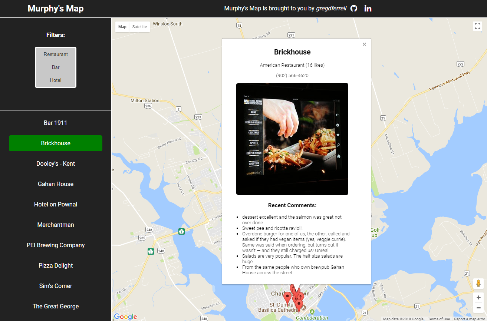
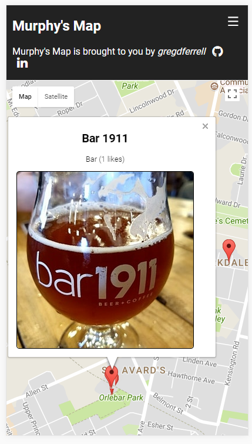

# fsw-p5-neighborhood-map

A google maps app showcasing Murphy Group locations in PEI. Created to learn Knockout.js, Google Maps API, CSS Grid, Node and front-end package management, it's the 5th project in the Udacity Full Stack Nanodegree.

## Usage & Screenshots

### Home

*Upon opening the app, the user can see a map of the Murphy Group locations on PEI. Clicking on any one of the list view or map markers opens an infowindow with details pulled from FourSquare's API.*

### Responsive

*The app is fully responsive, viewable on tablet and mobile devices.*

## Getting Started With Development
- This project is built and tested with:
  - Node version: 9.9.0
  - NPM version: 5.6.0
  - Webpack version: 4.5

### Setup
- `npm install` -> Download dependencies
- Populate `constants.js` with your FourSquare API client id and secret
- Populate `script` tag in `index.html` with your own Google Maps API key

### Run ESLint to validate JavaScript Code Style
- `./node_modules/.bin/eslint src`

### Running the App: Dev
- `npm start` -> Run in dev mode

### Build Prod
- `npm run build` -> Create `bundle.js` production distribution
